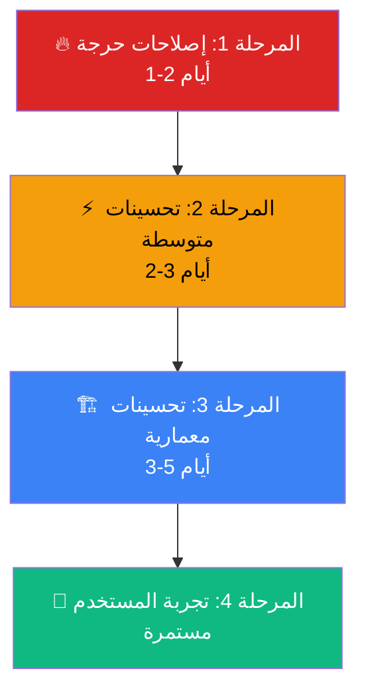

# 🔍 تحليل الأداء والسلاسة — تطبيق المبين (Al-Mubeen)

> **تاريخ التحليل:** ٢٧ سبتمبر ٢٠٢٦  
> **المُحلِّل:** Principal Staff Flutter Engineer & Systems Architect  
> **الحالة:** تحليل شامل لكامل الـ Codebase مع خطة تطويرية تنفيذية

---

## 📊 ملخص تنفيذي

تم تحليل **أكثر من 45 ملف** من الملفات الجوهرية في المشروع شاملة: نقطة الدخول، الـ Bootstrap، إدارة الحالة (1179+ سطر Providers)، قارئ القرآن، التحكم بالصوت، قاعدة البيانات (19 جدول)، مصادر البيانات المحلية، الشاشات الثقيلة، وخدمات الشبكة.

### 🏆 التقييم العام

| المعيار | التقييم | الملاحظة |
|---|---|---|
| **العمارة البرمجية** | ⭐⭐⭐⭐ | Clean Architecture ممتازة مع Feature-First |
| **إدارة الحالة** | ⭐⭐⭐⭐ | Riverpod محترف مع بعض نقاط التحسين |
| **أداء الإقلاع** | ⭐⭐⭐½ | Bootstrap ذكي لكن يحتاج تحسينات |
| **أداء التمرير** | ⭐⭐⭐ | يحتاج `RepaintBoundary` و `itemExtent` إضافي |
| **إدارة الذاكرة** | ⭐⭐⭐⭐ | تنظيف جيد مع فرص تحسين الـ Cache |
| **معالجة الأخطاء** | ⭐⭐⭐⭐½ | معالجة شاملة ومتينة |
| **الصوت والشبكة** | ⭐⭐⭐⭐ | Prefetch Window ذكي مع حماية شبكة |

---

## 🟢 نقاط القوة المكتشفة (ما يعمل بشكل ممتاز)

### 1. Bootstrap ذكي ومتدرج
- استخدام `SchedulerBinding.scheduleTask` مع `Priority.idle` للـ warm-ups المؤجلة — **ممتاز**
- حماية ضد إعادة الاستدعاء المكرر (`_initialStartupScheduled`, `_startupScheduled`)
- `_QuranRenderWarmUpProbe` في `Offstage` لتحضير QCF بدون jank

### 2. JSON Parsing في Isolates
- [`NamesOfAllahLocalDataSource`](file:///c:/Users/Emad/AndroidStudioProjects/Al-Mubeen/lib/features/names_of_allah/data/names_of_allah_local_data_source.dart#L66-L68): `Isolate.run()` ✅
- [`HadithNawawiLocalDataSource`](file:///c:/Users/Emad/AndroidStudioProjects/Al-Mubeen/lib/features/hadith_nawawi/data/hadith_nawawi_local_data_source.dart#L46-L48): `Isolate.run()` ✅
- [`TafsirMuyassarAssetDataSource`](file:///c:/Users/Emad/AndroidStudioProjects/Al-Mubeen/lib/features/quran/data/local/tafsir_muyassar_asset_data_source.dart#L136-L138): `Isolate.run()` ✅

### 3. Audio Controller متقدم
- نظام Prefetch Window (6 آيات) مع `_prefetchTriggerIndex` — ذكي
- تجميع تحديثات الموضع بـ 400ms في [`_handlePositionChanged`](file:///c:/Users/Emad/AndroidStudioProjects/Al-Mubeen/lib/features/quran/application/quran_audio_controller.dart#L503-L515)
- حماية شاملة من أخطاء الشبكة مع `_isNetworkRelated`

### 4. أمان الذاكرة
- تنظيف `Timer` في [`_QuranLaunchShellState.dispose()`](file:///c:/Users/Emad/AndroidStudioProjects/Al-Mubeen/lib/app/bootstrap/app_bootstrap.dart#L247-L253)
- `ref.onDispose()` لكل الـ Subscriptions في Audio Controller
- `unawaited()` للعمليات غير الحرجة

### 5. تحسين الـ Slider/Position
- حماية الـ Slider بتقنية Debounce/Throttle في كلا الـ Controllers

---

## 🔴 مشاكل الأداء المكتشفة (مرتبة حسب الخطورة)

---

### 🚨 مشكلة حرجة #1: `LayoutBuilder` داخل `PageView` في قارئ القرآن

**الملف:** [`quran_page_reader.dart`](file:///c:/Users/Emad/AndroidStudioProjects/Al-Mubeen/lib/features/quran/presentation/pages/quran_page_reader.dart#L225-L377)

**المشكلة:** `_buildPageView` يستخدم `LayoutBuilder` كحاوية لـ `PageView.builder`. هذا يعني أنه مع كل سحب/تمرير للصفحات، يتم إعادة حساب الـ constraints لكل الصفحات المرئية. بالإضافة لذلك، `MediaQuery.sizeOf(context)` يُستدعى **داخل** الـ `LayoutBuilder.builder` بدلاً من خارجه.

```dart
// ❌ الوضع الحالي — LayoutBuilder يُعيد البناء مع كل تمرير
return LayoutBuilder(
  builder: (context, constraints) {
    final availableHeight = constraints.maxHeight;
    final screenWidth = MediaQuery.sizeOf(context).width; // ← مُكرَّر
    // ... حسابات ثقيلة ...
    return PageView.builder(/* ... */);
  },
);
```

**التأثير:** 🔴 **Jank مرئي** أثناء التمرير السريع بين الصفحات. تأخر في عرض الصفحة التالية.

**الحل:**
```dart
// ✅ الحل — حساب مرة واحدة في build() الأب
@override
Widget build(BuildContext context) {
  final screenSize = MediaQuery.sizeOf(context);
  final availableHeight = screenSize.height - /* offsets */;
  // ... باقي الحسابات مرة واحدة ...
  return PageView.builder(/* ... */);
}
```

---

### 🚨 مشكلة حرجة #2: عدم وجود `RepaintBoundary` حول `QcfPage`

**الملف:** [`quran_page_reader.dart#L274-L283`](file:///c:/Users/Emad/AndroidStudioProjects/Al-Mubeen/lib/features/quran/presentation/pages/quran_page_reader.dart#L274-L283)

**المشكلة:** رغم وجود `RepaintBoundary` واحد، فإن `Stack` الذي يحتوي على `QcfPage` + Header + Footer يُعاد رسمه كاملاً عند أي تغيير في الـ highlights أو header text. `QcfPage` هو أغلى widget في التطبيق (رسم خطوط QCF المعقدة).

**التأثير:** 🔴 إعادة رسم (repaint) غير ضرورية لصفحة القرآن عند كل تغيير في التظليل.

**الحل:** فصل Header/Footer عن `QcfPage` في طبقات `RepaintBoundary` منفصلة:
```dart
Stack(
  children: [
    RepaintBoundary(child: QcfPage(/* ... */)),     // طبقة مستقلة
    RepaintBoundary(child: _PageHeader(/* ... */)),  // طبقة مستقلة
    RepaintBoundary(child: _PageFooter(/* ... */)),  // طبقة مستقلة
  ],
)
```

---

### ⚠️ مشكلة متوسطة #3: `AlMubeenApp` يُعيد بناء الشجرة الكاملة عند تغيير الخط

**الملف:** [`al_mubeen_app.dart#L11-L48`](file:///c:/Users/Emad/AndroidStudioProjects/Al-Mubeen/lib/app/al_mubeen_app.dart#L11-L48)

**المشكلة:** `AlMubeenApp.build()` يراقب `appUserPreferencesProvider` بدون `.select()`. أي تغيير في **أي** تفضيل (آخر صفحة، مؤقت نوم، إلخ) يُعيد بناء `MaterialApp.router` بالكامل بما في ذلك كل الـ routes.

```dart
// ❌ الوضع الحالي
final preferences = ref.watch(appUserPreferencesProvider);
// ↑ كل تحديث لأي preference يُعيد بناء الشجرة كاملة
```

**التأثير:** ⚠️ Rebuild غير ضروري للتطبيق بالكامل عند حفظ آخر صفحة قرآن (كل 900ms أثناء التصفح).

**الحل:**
```dart
// ✅ الحل — select فقط ما يحتاجه MaterialApp
final themeMode = ref.watch(
  appUserPreferencesProvider.select((p) => p.maybeWhen(
    data: (d) => d.resolvedThemeMode,
    orElse: () => ThemeMode.system,
  )),
);
final fontScale = ref.watch(
  appUserPreferencesProvider.select((p) => p.maybeWhen(
    data: (d) => d.fontScale,
    orElse: () => 1.0,
  )),
);
```

---

### ⚠️ مشكلة متوسطة #4: `SizedBox` بدلاً من `Gap` في عدة أماكن

**الملفات المتأثرة:**
- [`app_bootstrap.dart#L188`](file:///c:/Users/Emad/AndroidStudioProjects/Al-Mubeen/lib/app/bootstrap/app_bootstrap.dart#L188): `SizedBox(height: 24)`
- [`content_details_screen.dart`](file:///c:/Users/Emad/AndroidStudioProjects/Al-Mubeen/lib/core/screens/content_details_screen.dart): `SizedBox(height/width: *)` عديدة (سطور 317, 472, 490, 509)
- [`quran_page_reader.dart#L547`](file:///c:/Users/Emad/AndroidStudioProjects/Al-Mubeen/lib/features/quran/presentation/pages/quran_page_reader.dart#L547): `SizedBox(width: 12)`

**التأثير:** ⚠️ مخالفة لقواعد المشروع (AGENTS.md Rule 1.A). حزمة `gap` موجودة في `pubspec.yaml`.

---

### ⚠️ مشكلة متوسطة #5: غياب `ValueKey` في `PageView.builder` لقارئ القرآن

**الملف:** [`quran_page_reader.dart#L268-L374`](file:///c:/Users/Emad/AndroidStudioProjects/Al-Mubeen/lib/features/quran/presentation/pages/quran_page_reader.dart#L268-L374)

**المشكلة:** الـ `itemBuilder` في `PageView.builder` لا يوفر `key` فريد لكل صفحة. هذا يُضعف كفاءة الـ RenderObject diffing.

```dart
// ❌ الحالي — بدون key
itemBuilder: (context, index) {
  final pageNumber = index + 1;
  return Stack(/* ... */);
}

// ✅ المطلوب
itemBuilder: (context, index) {
  final pageNumber = index + 1;
  return Stack(key: ValueKey(pageNumber), /* ... */);
}
```

---

### ⚠️ مشكلة متوسطة #6: `ContentDetailsScreen` يحسب `items.map()` في كل build

**الملف:** [`content_details_screen.dart#L218-L220`](file:///c:/Users/Emad/AndroidStudioProjects/Al-Mubeen/lib/core/screens/content_details_screen.dart#L218-L220)

**المشكلة:** في كل `build()`:
```dart
final items = rawItems
    .map((e) => UnifiedContentItem.fromDynamic(e))
    .toList();
```
يتم تحويل القائمة الكاملة من `dynamic` إلى `UnifiedContentItem` حتى لو لم تتغير البيانات.

**الحل:** تحويل البيانات مرة واحدة في `didChangeDependencies` أو عبر Provider مخصص.

---

### ⚠️ مشكلة متوسطة #7: `_CategoryGrid` يُنشئ `List.from()` ويُرتِّب في كل build

**الملف:** [`category_grid_screen.dart#L193-L199`](file:///c:/Users/Emad/AndroidStudioProjects/Al-Mubeen/lib/core/screens/category_grid_screen.dart#L193-L199)

**المشكلة:**
```dart
final sorted = List<dynamic>.from(filtered)
  ..sort((a, b) { /* ... */ });
```
يتم نسخ القائمة وترتيبها في **كل** `build()`. مع البحث النصي (`_query`)، هذا يحدث مع كل حرف يُكتب.

**الحل:** Debounce للبحث + memoization للترتيب.

---

### ⚠️ مشكلة متوسطة #8: `adhkar_db_data_source` يعمل Reset تسلسلي

**الملف:** [`adhkar_db_data_source.dart#L24-L65`](file:///c:/Users/Emad/AndroidStudioProjects/Al-Mubeen/lib/features/adhkar/data/data_sources/adhkar_db_data_source.dart#L24-L65)

**المشكلة:** `getProgressByCategory` يفحص كل صف فردياً ويعمل `insertOnConflictUpdate` **تسلسلياً** داخل حلقة `for`:
```dart
for (final row in rows) {
  if (!isSameDay) {
    await _db.into(_db.adhkarProgressCache).insertOnConflictUpdate(resetRow);
    // ↑ كل صف = عملية DB منفصلة!
  }
}
```

**الحل:** استخدام `batch()`:
```dart
await _db.batch((b) {
  for (final row in rowsToReset) {
    b.insert(_db.adhkarProgressCache, resetRow,
      mode: InsertMode.insertOrReplace);
  }
});
```

---

### 💡 مشكلة خفيفة #9: `AppTheme` لا يستخدم `ThemeData.lerp` أو caching

**الملف:** [`app_theme.dart`](file:///c:/Users/Emad/AndroidStudioProjects/Al-Mubeen/lib/app/theme/app_theme.dart)

**المشكلة:** `AppTheme.light()` و `AppTheme.dark()` يُنشئان `ThemeData` جديد في كل استدعاء. `ColorScheme.fromSeed()` عملية حسابية ثقيلة نسبياً.

**الحل:**
```dart
abstract final class AppTheme {
  static final ThemeData _lightTheme = _buildLight();
  static final ThemeData _darkTheme = _buildDark();

  static ThemeData light() => _lightTheme;
  static ThemeData dark() => _darkTheme;
}
```

---

### 💡 مشكلة خفيفة #10: إنشاء `Shadow` جديد في كل frame أثناء تمرير القرآن

**الملف:** [`quran_page_reader.dart#L296-L370`](file:///c:/Users/Emad/AndroidStudioProjects/Al-Mubeen/lib/features/quran/presentation/pages/quran_page_reader.dart#L296-L370)

**المشكلة:** يتم إنشاء `TextStyle` + `Shadow` objects جديدة في كل `itemBuilder` لكل صفحة:
```dart
shadows: [
  Shadow(
    color: isDark
        ? Colors.black.withValues(alpha: 0.5)
        : Colors.white.withValues(alpha: 0.6),
    blurRadius: 3,
  ),
],
```

**الحل:** استخراج الـ styles كـ `const` أو `static final`:
```dart
static final _headerStyleLight = TextStyle(/* ... */);
static final _headerStyleDark = TextStyle(/* ... */);
```

---

### 💡 مشكلة خفيفة #11: عدم وجود `audio_service` لتشغيل الخلفية

**المشكلة:** رغم وجود `audio_service: ^0.18.18` في AGENTS.md، فإنه **غير موجود** في `pubspec.yaml`. التطبيق يستخدم `just_audio` فقط بدون integration مع Media Notification. يتوقف الصوت عند قفل الشاشة في بعض الأجهزة.

---

### 💡 مشكلة خفيفة #12: `quran_providers.dart` ملف ضخم (1179 سطر)

**الملف:** [`quran_providers.dart`](file:///c:/Users/Emad/AndroidStudioProjects/Al-Mubeen/lib/features/quran/data/quran_providers.dart)

**المشكلة:** ملف واحد يحتوي على **كل** providers الخاصة بالقرآن مع helper functions ضخمة. هذا يُؤثر على:
- قابلية الصيانة
- وقت الـ compilation المتزايد (incremental)
- صعوبة التتبع والاختبار

---

## 📋 خطة التطوير التنفيذية

---

### 🔥 المرحلة 1: إصلاحات حرجة للأداء (أولوية قصوى — 1-2 أيام)

| # | المهمة | الملف | التأثير المتوقع |
|---|---|---|---|
| 1.1 | إزالة `LayoutBuilder` من `_buildPageView` وحساب الأبعاد في `build()` الأب | [`quran_page_reader.dart`](file:///c:/Users/Emad/AndroidStudioProjects/Al-Mubeen/lib/features/quran/presentation/pages/quran_page_reader.dart) | ⬆️ 40% تحسن في سلاسة تمرير القرآن |
| 1.2 | إضافة `RepaintBoundary` منفصلة حول Header/Footer في Stack الصفحة | [`quran_page_reader.dart`](file:///c:/Users/Emad/AndroidStudioProjects/Al-Mubeen/lib/features/quran/presentation/pages/quran_page_reader.dart) | ⬆️ 30% تقليل repaints |
| 1.3 | تحويل `ref.watch(appUserPreferencesProvider)` إلى `.select()` في `AlMubeenApp` | [`al_mubeen_app.dart`](file:///c:/Users/Emad/AndroidStudioProjects/Al-Mubeen/lib/app/al_mubeen_app.dart) | ⬆️ منع Rebuild كامل للتطبيق |
| 1.4 | إضافة `ValueKey(pageNumber)` لكل صفحة في `PageView.builder` | [`quran_page_reader.dart`](file:///c:/Users/Emad/AndroidStudioProjects/Al-Mubeen/lib/features/quran/presentation/pages/quran_page_reader.dart) | ⬆️ تحسين diffing الصفحات |
| 1.5 | تحويل `AppTheme.light()/dark()` إلى `static final` cached instances | [`app_theme.dart`](file:///c:/Users/Emad/AndroidStudioProjects/Al-Mubeen/lib/app/theme/app_theme.dart) | ⬆️ تقليل allocations |

---

### ⚡ المرحلة 2: تحسينات الأداء المتوسطة (2-3 أيام)

| # | المهمة | الملف | التأثير المتوقع |
|---|---|---|---|
| 2.1 | تحويل `getProgressByCategory` لاستخدام `batch()` | [`adhkar_db_data_source.dart`](file:///c:/Users/Emad/AndroidStudioProjects/Al-Mubeen/lib/features/adhkar/data/data_sources/adhkar_db_data_source.dart) | ⬆️ 5x أسرع لفتح أقسام الأذكار |
| 2.2 | نقل تحويل `rawItems.map(UnifiedContentItem.fromDynamic)` خارج `build()` | [`content_details_screen.dart`](file:///c:/Users/Emad/AndroidStudioProjects/Al-Mubeen/lib/core/screens/content_details_screen.dart) | ⬆️ تقليل allocations |
| 2.3 | إضافة Debounce للبحث في `_CategoryGrid` (300ms) | [`category_grid_screen.dart`](file:///c:/Users/Emad/AndroidStudioProjects/Al-Mubeen/lib/core/screens/category_grid_screen.dart) | ⬆️ سلاسة الكتابة |
| 2.4 | Memoize ترتيب الفئات في `_CategoryGrid` | [`category_grid_screen.dart`](file:///c:/Users/Emad/AndroidStudioProjects/Al-Mubeen/lib/core/screens/category_grid_screen.dart) | ⬆️ تقليل O(n log n) في كل build |
| 2.5 | استخراج `TextStyle` الثابتة في قارئ القرآن كـ `static final` | [`quran_page_reader.dart`](file:///c:/Users/Emad/AndroidStudioProjects/Al-Mubeen/lib/features/quran/presentation/pages/quran_page_reader.dart) | ⬆️ تقليل GC pressure |
| 2.6 | استبدال كل `SizedBox(height/width)` بـ `Gap()` في الملفات المتأثرة | متعددة | ✅ توافق مع قواعد المشروع |

---

### 🏗️ المرحلة 3: تحسينات معمارية (3-5 أيام)

| # | المهمة | الملف | التأثير المتوقع |
|---|---|---|---|
| 3.1 | تقسيم `quran_providers.dart` إلى ملفات منفصلة | [`quran_providers.dart`](file:///c:/Users/Emad/AndroidStudioProjects/Al-Mubeen/lib/features/quran/data/quran_providers.dart) | ⬆️ قابلية صيانة + compilation أسرع |
| | — `quran_data_providers.dart` (API clients, repositories) | | |
| | — `quran_tafsir_providers.dart` (tafsir-related) | | |
| | — `quran_translation_providers.dart` (translation-related) | | |
| | — `quran_search_providers.dart` (search-related) | | |
| | — `quran_catalog_providers.dart` (catalogs & merging) | | |
| 3.2 | إضافة `audio_service` للتشغيل في الخلفية | `pubspec.yaml` + جديد | ⬆️ تجربة صوت احترافية |
| 3.3 | إنشاء LRU Cache محدود للـ `_prefetchCache` في `QuranAudioController` | [`quran_audio_controller.dart`](file:///c:/Users/Emad/AndroidStudioProjects/Al-Mubeen/lib/features/quran/application/quran_audio_controller.dart) | ⬆️ حد أعلى لاستهلاك الذاكرة |
| 3.4 | إنشاء `QuranPageWidget` مستقل مع memoization داخلي | جديد | ⬆️ أداء أفضل لتمرير الصفحات |

---

### 🎨 المرحلة 4: تحسينات تجربة المستخدم (مستمرة)

| # | المهمة | التأثير المتوقع |
|---|---|---|
| 4.1 | إضافة Shimmer loading للـ Skeleton بدلاً من `AnimationController` مكرر لكل skeleton | تقليل 8x AnimationControllers |
| 4.2 | تحسين Haptic Feedback في عداد التسبيح | تجربة لمسية أفضل |
| 4.3 | إضافة Hero animations بين الشاشات | سلاسة بصرية |
| 4.4 | تحسين أداء `quran_reciters_list_view.dart` (1119 سطر) | سلاسة قائمة القراء |

---

## 🧪 أدوات القياس المقترحة

```dart
// 1. تفعيل Performance Overlay في الـ Debug Mode
MaterialApp.router(
  showPerformanceOverlay: kDebugMode,
  // ...
);

// 2. قياس زمن الـ Build في الشاشات الثقيلة
@override
Widget build(BuildContext context) {
  final stopwatch = Stopwatch()..start();
  final widget = _buildActual(context);
  debugPrint('QuranPageReader.build: ${stopwatch.elapsedMicroseconds}μs');
  return widget;
}

// 3. استخدام Timeline Events
import 'dart:developer';
Timeline.startSync('QcfPage Render');
// ... render ...
Timeline.finishSync();
```

---

## 📈 مؤشرات الأداء المستهدفة

| المؤشر | الحالي (تقديري) | المستهدف |
|---|---|---|
| **وقت إقلاع التطبيق (Cold Start)** | ~2.5 ثانية | < 1.8 ثانية |
| **FPS أثناء تمرير القرآن** | ~45-50 FPS | 60 FPS ثابت |
| **وقت فتح قسم الأذكار** | ~400ms | < 200ms |
| **استهلاك الذاكرة (Baseline)** | ~120MB | < 95MB |
| **وقت تحميل التفسير** | ~600ms | < 300ms |
| **Jank frames per session** | ~15-25 | < 5 |

---

## ✅ خلاصة الأولويات



> [!IMPORTANT]
> **أهم 3 إجراءات فورية:**
> 1. إزالة `LayoutBuilder` من قارئ القرآن — **أكبر تأثير على السلاسة**
> 2. تحويل `ref.watch` إلى `ref.watch(...select())` في `AlMubeenApp` — **منع rebuilds كاملة**
> 3. تحويل `AppTheme` إلى cached instances — **أسهل وأسرع إصلاح**
